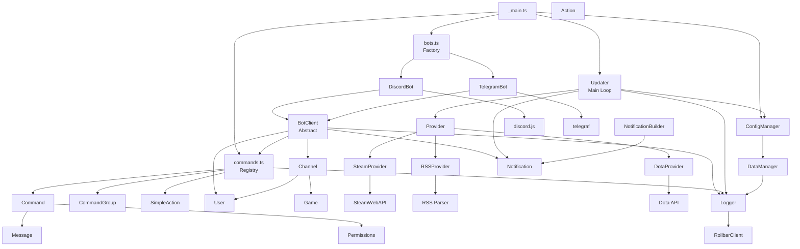

# GameFeeder Architecture & Dependency Diagram

## Project Overview
**GameFeeder** is a Node.js notification bot for games, available on Discord and Telegram. It aggregates news from multiple sources (Steam, RSS, Dota) and sends notifications to users.

---

## High-Level Architecture Diagram



---

## Module Breakdown by Layer

### 1. **Entry Point** (`_main.ts`)
- Starts the application
- Initializes managers
- Registers commands
- Starts bots and updaters

### 2. **Bot Layer** (`bots/`)
- **BotClient**: Abstract base class for all bots
- **DiscordBot**: Discord implementation using `discord.js`
- **TelegramBot**: Telegram implementation using `telegraf`
- **Bots**: Factory that returns available bots

**Key Responsibilities:**
- Handle incoming messages
- Send notifications
- Register commands
- Execute commands

### 3. **Command Layer** (`commands/`)
- **Command**: Abstract base class
- **Action**: Abstract action command (with labels)
- **SimpleAction**: Simple action without label
- **NoLabelAction**: Action without label
- **CommandGroup**: Group of commands
- **TwoPartCommand**: Two-part command
- **Commands**: Central registry of all commands

**Key Responsibilities:**
- Parse user input
- Execute game-specific logic
- Return responses

### 4. **Core Models**
- **User**: User with roles and permissions
- **Channel**: Discord/Telegram channel
- **Message**: Message wrapper
- **Game**: Game configuration and metadata
- **Permissions**: Permission checks for users

### 5. **Provider Layer** (`providers/`)
- **Provider**: Abstract data provider
- **SteamProvider**: Fetches Steam app news
- **RSSProvider**: Parses RSS feeds
- **DotaProvider**: Fetches Dota 2 specific data

### 6. **Data Source Layer**
- **Steam API**: `steam_web_api.ts`, `steam_app_news.ts`
- **RSS**: `rss.ts`, `rss_item.ts`
- **Dota API**: Dota 2 specific data sources

### 7. **Notification System** (`notifications/`)
- **Notification**: Main notification object
- **NotificationBuilder**: Builds notifications from data
- **NotificationElement**: Individual elements
- **Version**: Version tracking

### 8. **Processing Layer** (`processors/`)
- **PreProcessor**: Preprocesses raw data
- **SteamProcessor**: Special processing for Steam data
- **Updater**: Main update loop that fetches new data

### 9. **Manager Layer** (`managers/`)
- **ConfigManager**: Loads and manages configuration
- **DataManager**: Manages subscriber/user data
- **FileManager**: File I/O operations
- **InitManager**: Initializes all systems
- **ProjectManager**: Project metadata and versioning

### 10. **Utility Layer** (`util/`)
- **Logger**: Winston-based logging
- **RollbarClient**: Error tracking with Rollbar
- **Utilities**: String, array, regex, constants helpers

### 11. **External Dependencies**
- **discord.js**: Discord client
- **telegraf**: Telegram bot framework
- **rss-parser**: RSS parsing
- **steam-web-api**: Steam API client
- **pubsub-js**: Pub/Sub messaging
- **winston**: Logging framework
- **rollbar**: Error tracking

---

## Data Flow Example: Sending a Game Update

```
Updater (main loop)
  ↓
  Provider (e.g., SteamProvider)
    ↓
    Steam API
    ↓
  SteamAppNews (parsed data)
    ↓
  SteamProcessor (validate & process)
    ↓
  NotificationBuilder (format message)
    ↓
  Notification (ready to send)
    ↓
  BotClient (DiscordBot or TelegramBot)
    ↓
  Send to Channel/User
```

---

## Key Design Patterns

1. **Singleton Pattern**: `RollbarClient`, managers
2. **Abstract Factory**: Bot creation, Command creation
3. **Observer Pattern**: PubSub for bot events
4. **Template Method**: `Provider`, `Command`, `BotClient`
5. **Decorator Pattern**: `CommandGroup` wraps other commands
